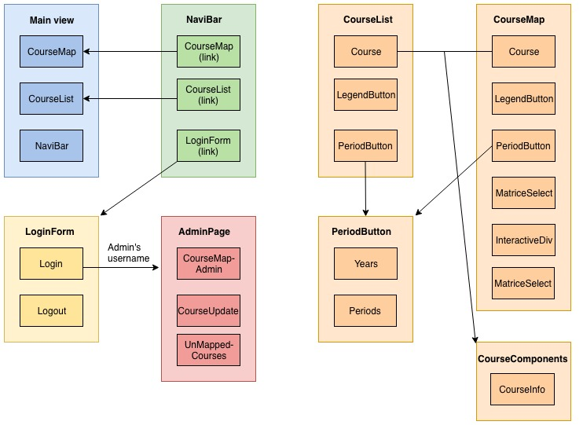

# Architecture document of Kurssikartta-sovellus

##### Projektiryhmä:

* Juslenius Santeri
* Moisio Mikko
* Rikander Tomi
* Varilo Miro

##### Asiakas:
TKO-äly

## Introduction

Kurssikartta is a course map application, intended for the students of computer science in university of Helsinki. With the application students can view ongoing courses and plan their studies. The software utilizes react and node.js.

## Architecture

The following diagram offers the structure of main views and main components of the software. It follows loosely the directory structure of the app and the layout of the website. Main components and views are in bigger boxes, while the basic components of those are placed inside those boxes.
Arrows symbolize clicks and transitions that can be done in the app.

